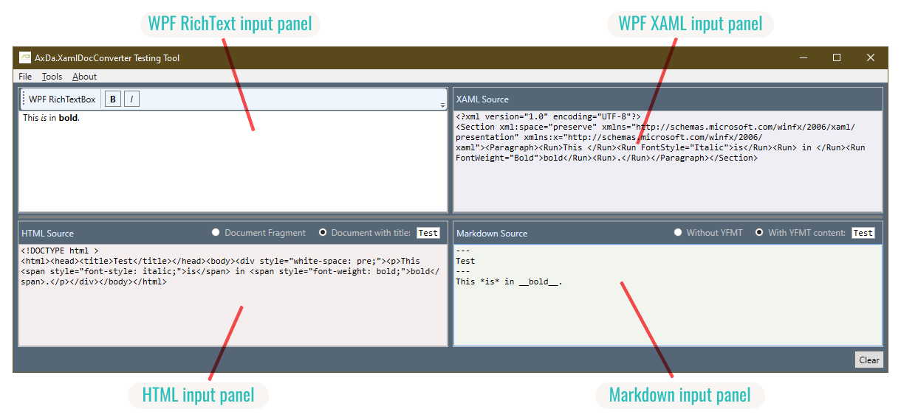

# AxDa.XamlDocConverter Testing Tool

The [`AxDa.XamlDocConverter`](https://www.nuget.org/packages?q=AxDa.XamlDocConverter) NuGet package family provides high-performance, low-allocating conversion from WPF Flow Document content to HTML or Markdown and vice versa.

**Using the .NET AxDa.XamlDocConverter test tool you now can easily test these NuGet packages.**

The .NET AxDa.XamlDocConverter testing tool allows you to quickly check the result of converting WPF Flow Document content to HTML or Markdown and vice versa.

Just enter arbitrary content into any of the .NET AxDa.XamlDocConverter testing tool's text editors and examine what is being created by [`AxDa.XamlDocConverter.Html`](https://www.nuget.org/packages/AxDa.XamlDocConverter.Html) and [`AxDa.XamlDocConverter.Markdown`](https://www.nuget.org/packages/AxDa.XamlDocConverter.Markdown). The content of the other input fields is immediately updated as you type.

## Features

The .NET AxDa.XamlDocConverter testing tool provides great features for examining how the `AxDa.XamlDocConverter`s convert WPF flow document content to HTML or Markdown and vice versa.

Lets examine these features one by one:

The main window is divided into four different panels:

1. The upper left pane contains a WPF [`RichTextBox`](https://learn.microsoft.com/en-us/dotnet/desktop/wpf/controls/richtextbox-overview) control. Use this control to enter text as you would in any other WPF application. All other panels are updated in real time with the converted results as you type. Two text style buttons in the text box toolbar allow for easy text formatting.

1. The upper right pane contains a WPF [`TextBox`](https://learn.microsoft.com/en-us/dotnet/desktop/wpf/controls/textbox-overview) control that displays the **XAML Flow Document source** from the [`RichTextBox`](https://learn.microsoft.com/en-us/dotnet/desktop/wpf/controls/richtextbox-overview) control in the upper left pane. In this text input field, you can edit the XAML source code. All other panels are updated in real time with the converted results as you type.

1. The lower left pane contains a WPF [`TextBox`](https://learn.microsoft.com/en-us/dotnet/desktop/wpf/controls/textbox-overview) control that displays the **HTML equivalent** converted from the upper left pane's [`RichTextBox`](https://learn.microsoft.com/en-us/dotnet/desktop/wpf/controls/richtextbox-overview) control. In this text input field, you can edit the HTML source code. All other panels are updated in real time with the converted results as you type. Use the radio buttons in this panel to select whether to create a complete HTML document or just an HTML fragment. You can also enter a sample HTML document title text here to be used during conversion.

1. The lower right pane contains a WPF [`TextBox`](https://learn.microsoft.com/en-us/dotnet/desktop/wpf/controls/textbox-overview) control that displays the **Markdown equivalent** from the [`RichTextBox`](https://learn.microsoft.com/en-us/dotnet/desktop/wpf/controls/richtextbox-overview) control in the upper left pane. In this text input field, you can edit the Markdown source code. All other panels are updated in real time with the converted results as you type. Use the radio buttons in this pane to select whether to create a YAML Frontmatter header. You can also enter sample text for the YAML Frontmatter part here to be used during conversion.

## How To Use

Simply enter any text you feel appropriate into any of the text input controls. All other controls will immediately update as you type:

While typing, errors may appear in the lower pane. These errors are primarily due to malformed XML encountered during typing.

Markdown and HTML are not directly converted to each other. Instead, the text of the focused input field is first converted to XAML and then from XAML to the other format.

### Watch This Great Tutorial Video:

&nbsp;&emsp;&nbsp;&emsp;&nbsp;&emsp;&nbsp;&emsp;&nbsp;&emsp;&nbsp;&emsp;&nbsp;&emsp;&nbsp;&emsp;&nbsp;&emsp;

## Visual Styles

This simple tool doesn't add any visual style information to the [`RichTextBox`](https://learn.microsoft.com/en-us/dotnet/desktop/wpf/controls/richtextbox-overview) control in the upper left area. It simply displays the raw WPF XAML Flow Document. Feel free to apply your preferred set of visual styles to the converted documents in your own tools and applications! The [`AxDa.XamlDocConverter`](https://www.nuget.org/packages?q=AxDa.XamlDocConverter) NuGet package family of converters allows you to easily apply your preferred set of visual styles to the converted documents.

## Options

- **Enforce "white-space preserve"**

  A peculiarity of the WPF parser requires the presence of the `xml:space=preserve` XML attribute in the root element. If this attribute is not present in the XML root element, the WPF renderer may not display words with the expected word break.

  However, this requirement typically results in the resulting XML being output as a single, long line. For troubleshooting purposes, you can disable this option in the Options dialog window. The resulting XML will then be output with normal indentation. However, the result will not be WPF-compatible if this option is disabled.